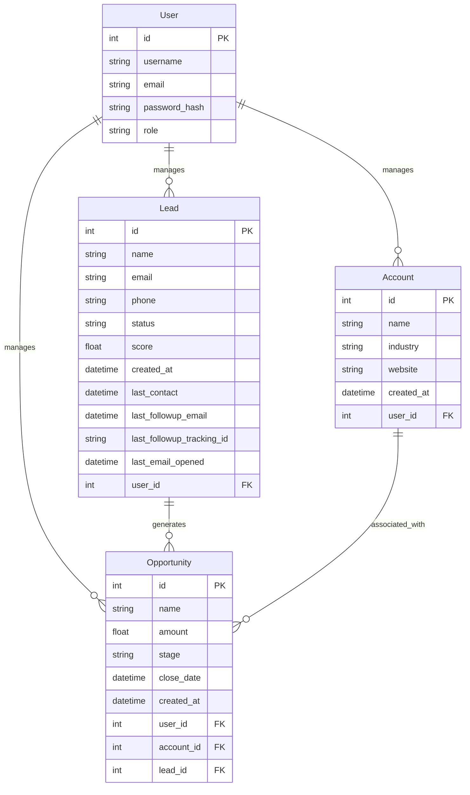

# ER Diagram for CRM Application

## Explanation of Key Relationships and Design Decisions

1. User to Lead, Opportunity, and Account (One-to-Many):
   - A User can manage multiple Leads, Opportunities, and Accounts.
   - This allows for individual user management of customer relationships.

2. Lead to Opportunity (One-to-Many):
   - A Lead can generate multiple Opportunities.
   - This reflects the sales process where a single lead may result in multiple potential deals.

3. Account to Opportunity (One-to-Many):
   - An Account can be associated with multiple Opportunities.
   - This allows tracking multiple deals with the same company or organization.

4. Lead to User (Many-to-One):
   - Each Lead is associated with one User (the manager).
   - This enables clear ownership and responsibility for each lead.

5. Opportunity to User (Many-to-One):
   - Each Opportunity is associated with one User (the manager).
   - This allows tracking who is responsible for each deal.

6. Account to User (Many-to-One):
   - Each Account is associated with one User (the manager).
   - This enables clear ownership and responsibility for each account.

7. Opportunity to Lead (Many-to-One):
   - Each Opportunity is optionally associated with one Lead.
   - This allows tracking which lead generated a specific opportunity, if applicable.

Key Design Decisions:
1. Use of separate entities for Lead, Opportunity, and Account:
   - This separation allows for more granular tracking of the sales process.
   - It reflects the typical CRM workflow from lead generation to opportunity management to account maintenance.

2. Inclusion of a User entity:
   - This enables multi-user support and user-specific data management.
   - The 'role' field in the User entity allows for potential role-based access control.

3. Tracking of email interactions in the Lead entity:
   - Fields like 'last_followup_email' and 'last_email_opened' enable email campaign tracking and analysis.

4. Inclusion of 'score' field in the Lead entity:
   - This allows for lead scoring functionality, potentially using AI or custom algorithms.

5. Detailed tracking of Opportunities:
   - Fields like 'amount', 'stage', and 'close_date' allow for comprehensive sales pipeline management and forecasting.

This ER diagram and schema design provide a solid foundation for a CRM system, allowing for efficient management of customer relationships throughout the sales cycle.
